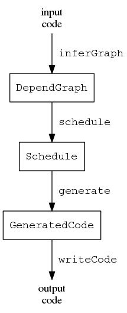
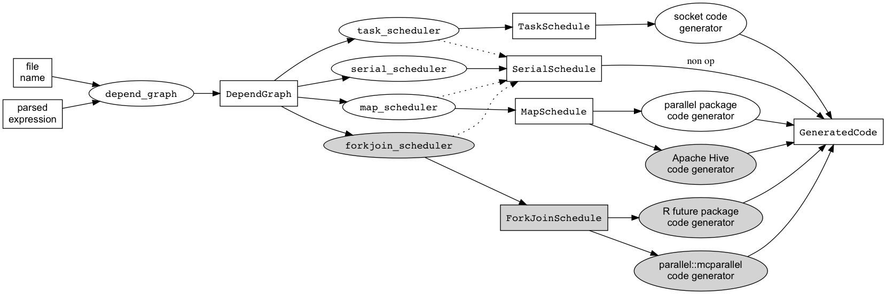

<!--
[](https://travis-ci.org/clarkfitzg/makeParallel)

Copied this over from future package

<%@meta language="R-vignette" content="--------------------------------
%\VignetteIndexEntry{Generating Parallel Code with the makeParallel Package}
%\VignetteAuthor{Clark Fitzgerald}
%\VignetteKeyword{R}
%\VignetteKeyword{package}
%\VignetteKeyword{vignette}
%\VignetteKeyword{future}
%\VignetteKeyword{promise}
%\VignetteEngine{R.rsp::rsp}
%\VignetteEngine{knitr::rmarkdown}
%\VignetteTangle{FALSE}
--------------------------------------------------------------------"%>
# <%@meta name="title"%>
-->

> This vignette explains the concepts used by makeParallel. If you would
> like to quickly get started then see the vignette titled "makeParallel
> Quick Start", `vignette("quickstart", package = "makeParallel")`.

This project is experimental and ambitious.
To write parallel R today consider using an established package, such as the recommended [parallel package](https://stat.ethz.ch/R-manual/R-devel/library/parallel/doc/parallel.pdf) which has been included with R since version 2.14.
The CRAN Task View [High-Performance and Parallel Computing with R](https://cran.r-project.org/view=HighPerformanceComputing) provides a thorough review of available third party software.


## Big Picture

makeParallel makes code parallel.
It statically analyzes entire scripts to detect dependencies between statements and implements a modular system for generating new code.

The appeal of this approach is that we don't have to change our code to make it parallel.
We can write higher level code that also performs better.
By allowing this _system_ to change our code we can benefit from underlying improvements in the system, and change code in ways that we may have never thought of, or that were manually infeasible.
This is akin to an optimizing compiler.
As the compiler becomes smarter, the same programs run faster, with no change to the underlying code.
makeParallel creates R code from R code, so in this sense it acts as a [transpiler](https://en.wikipedia.org/wiki/Source-to-source_compiler).


## Comparison to conventional approach

Most conventional approaches to parallel programming require the __user__ to specify when and where the program should run in parallel.
They do this by providing their own programming models and application programming interfaces.
The conventional approach has several advantages.
First of all, it works.
It scales up to huge clusters.
Well defined interfaces simplify understanding and debugging.
The approach also has disadvantages.
It usually requires programmers to use more knowledge of the underlying system, data, and computations to use it effectively.

<!--
Parallelism is used to make code run faster.
The standard advice for making
code run faster is:

1.
Write simple code that does what we want
2.
Profile it to see what's slow
3.
Make the slow parts faster
-->

In contrast to the conventional approach, makeParallel takes general R code and automatically transforms it into parallel code.
Thus the __system__ must determine a correct and reasonably efficient way to execute parts of the program in parallel.

makeParallel builds on existing infrastructure wherever possible.
For example, it uses `parallel::makeCluster` to initialize clusters of workers communicating over sockets.
Indeed, the conventional approaches provide the lower level tools.


<!--
Could compare to multi threaded BLAS
-->

## Basic Model

The following diagram illustrates the computational model for the steps in inferring parallelism as implemented in the function `makeParallel`.



In this diagram the rectangles represent base classes defined in this package, and the edges represent generic methods.
The diagram depicts the following:

1. The end user supplies some input code, which could be the name of a file or an actual expression.
2. `inferGraph` statically analyzes the code and constructs a dependency graph between the expressions currently based on [use-definition chains](https://en.wikipedia.org/wiki/Use-define_chain).
   A future version of the software will allow other types of constraints, such as requiring two expressions to run on the same processor.
3. `schedule` assigns each expression to a processor and orders the expression on each processor, while respecting the constraints of the dependency graph.
4. `generate` creates executable code from the schedule.
5. `writeCode` simply writes the code to a file and returns the expression containing the code.

These steps are all designed to be modular.
The most interesting step is the `scheduler`.
In general scheduling a task graph is NP hard, and many algorithms exist to solve this problem.


## Data Parallelism

The default scheduler produces a `MapSchedule` which represents data parallelism.
This captures the common and useful case of "embarrassingly parallel" operations.
These come from replacing apply type functions with equivalent parallel versions.
The current implementation is basic and does the following:

- Identifies `for` loops that can be parallelized
- Replaces top level `lapply` and `mapply` with their `mc` equivalents from the parallel package
- Avoids nested parallelism

Future versions may include the following features.
If you need these sooner then get in touch.

- Marking expressions that can be embarrassingly parallel
- Deciding whether or not to run each expression in parallel
- Generating code for Windows
- Handling more apply style functions, ie. `apply, replicate`
- Making vectorized operations parallel
- Splitting data and keeping it distributed for the duration of the program


## Task Parallelism

Task parallelism means two or more workers execute two or more different blocks of code simultaneously.

The only way to get a speedup from task parallelism is if the dependency graph _allows_ two or more long running parts of the program to run simultaneously.
This could happen when reading two large files, for example.
`scheduleTaskList` implements a standard list scheduling algorithm.
The algorithm needs the execution time for each expression to work properly so we pass it in explicitly below.

```{r echo=FALSE, eval=FALSE, results='hide',message=FALSE}

    n = 1e6

    xfile = tempfile()
    write.csv(data.frame(x = rnorm(n)), xfile, row.names = FALSE)

    yfile = tempfile()
    write.csv(data.frame(y = rnorm(n)), yfile, row.names = FALSE)

```

```{r, fig.width = 8, fig.height = 6, results = "hide"}
library(makeParallel)

code = parse(text = "
    x = read.csv(xfile)
    y = read.csv(yfile)
    xy = sort(c(x[, 1], y[, 1]))
    ")

g = inferGraph(code, time = c(1.25, 1.24, 0.2))

pcode = makeParallel(graph = g, scheduler = scheduleTaskList)

plot(schedule(pcode))
```

This plot illustrates the schedule returned from the scheduling algorithm.
The completion time of the script is the last time a processor is busy on the graph.
More efficient schedules complete earlier.
This plot is a useful diagnostic- if all cores are mostly busy that's a good sign.
If only one core does almost all the work then either 1) the code can't be improved through task parallelism, or 2) the default scheduling algorithm chose a poor schedule.
The task scheduling problem is a very rich problem with many published algorithms, so we leave hooks in for users to supply their own scheduling algorithm.

The generated code is a beastly thing that no sane person would ever write by hand.
But it does have a few virtues:

- It runs
- It does the same thing as the serial version while being faster

```{r}
writeCode(pcode)
```


## Customizability

`makeParallel` allows us to pass in functions that customize the behavior.
For example, we may want the generated code to explicitly set the number of parallel workers to `N` as specified by the option `mc.cores` in the parallel package.
The following function prepends the expression `options(mc.cores = N)` to the generated code.

```{r}
coresGenerate <- function(schedule, mc.cores = 2L, ...)
{
    # Rely on the method dispatch for the actual work.
    out <- generate(schedule, ...)

    # Construct an expression containing the desired code.
    setCores <- substitute(options(mc.cores = MC_CORES)
                          , list(MC_CORES = mc.cores))

    # Combine the newly constructed expression with what would have been
    # generated otherwise.
    out@code <- c(setCores, writeCode(out))
    out
}
```

We can use this function as follows:

```{r}
lapplyCode <- parse(text = "
    x <- list(a = 1:10, beta = exp(-3:3), logic = c(TRUE,FALSE,FALSE,TRUE))
    m1 <- lapply(x, mean)
")

transformed <- makeParallel(lapplyCode, generator = coresGenerate,
                            generatorArgs = list(mc.cores = 3L))
```

When we extract the code from this object with `writeCode` we see that it sets `options(mc.cores = 3L)` as the first line.

```{r}
writeCode(transformed)
```

```{r, echo = FALSE, results = "hide"}
# Testing, make sure the docs do what they say!
stopifnot(writeCode(transformed)[[1]] == quote(options(mc.cores = 3L)))
```


## Extensibility

Some schedulers must be tied to their code generators.
`inferGraph, schedule`, and `generate` are all generic functions, so we can allow user defined classes to extend the system through R's S4 object oriented programming system.

Building on the example above, we can define a class `WorkerMapSchedule` containing `MapSchedule` that adds a slot for `mc.cores`.

```{r}
setClass("WorkerMapSchedule", slots = c(mc.cores = "integer"), contains = "MapSchedule")
```

Here's a helper constructor function:

```{r}
workerMapSchedule = function(graph, mc.cores = 2L, ...)
{
    message(sprintf("User defined scheduler, mc.cores = %s", mc.cores))
    out = mapSchedule(graph, ...)
    new("WorkerMapSchedule", out, mc.cores = mc.cores)
}
```

Now we need to associate a code generator with `WorkerMapSchedule`.
We can use an existing one or we can define our own.
Since we've already defined `coresGenerate` above we'll just wrap that.

```{r}
setMethod("generate", "WorkerMapSchedule", function(schedule, ...)
    coresGenerate(as(schedule, "MapSchedule"), mc.cores = schedule@mc.cores, ...)
)
```

Finally, we can use the code as follows:

```{r}
transformed <- makeParallel(code, scheduler = workerMapSchedule, mc.cores = 3L)

writeCode(transformed)
```

```{r, echo = FALSE, results = "hide"}
# Testing, make sure the docs do what they say!
stopifnot(writeCode(transformed)[[1]] == quote(options(mc.cores = 3L)))
```


In this section we went beyond the basic customization in the previous section in two ways.
First, we extended the existing class hierarchy by defining our own scheduler.
Second, we defined methods and relied on method dispatch to control some aspects of the code generation process.
We did not have to touch the dependency graph computations.


## Summary

Users can specify the scheduling and code generation steps by passing functions or defining methods.
Here's an associated mental model for the possible steps taken by the `makeParallel` function.



The shaded nodes are not yet fully implemented.

In summary, `makeParallel` can be used in the following ways:

- `makeParallel(code)` simple, common use case
- `makeParallel("some_script.R")` dispatches on the class of the first argument.
- `makeParallel(graph = g)` skips the dependency graph inference in case the user would like to supply their own graph.
- `makeParallel(code, scheduler = my_scheduler, generator = my_code_generator)` allows users to both customize the steps in the process by passing in their own functions to perform them.
- `makeParallel(code, scheduler = scheduleTaskList)` dispatches on the class of the resulting objects allowing users to extend the system through defining their own classes.


## Static Analysis

Code transformation relies on static code analysis.
This means we don't actually run any code until the user specifically asks for it.
The [CodeDepends package](https://github.com/duncantl/CodeDepends) currently provides most of the underlying tools.

As we build more tools that may be useful for general purpose static R code analyis we've been putting them in the [CodeAnalysis package](https://github.com/duncantl/CodeAnalysis).
makeParallel will most likely come to depend on CodeAnalysis.


## Plans

The following features are planned, but not yet implemented.

### Short Term

1. Handle calls to `library()`
2. Generate code for Windows
3. Use measured information on expression run time and object sizes
1. Add constraints for processes, ie. code that performs plotting must happen in one process
1. Show which code actually changed, perhaps by providing a `diff()` method
2. More efficient scheduling algorithms
3. Detection of objects with reference semantics to handle appropriately

### Longer Term

1. Identify conditional versus unconditional data dependencies and handle appropriately
2. Handle [output dependencies](https://en.wikipedia.org/wiki/Data_dependency#Output_dependency) aka Write After Write (WAW) dependencies.
1. Allow users to pass information about the data, ie. dimensions and types.
2. Infer dimensions and run time when possible.
3. Generate code that uses systems besides R, for example Apache Hive.

## Challenges

Some R code is more difficult to parallelize. This package currently
doesn't handle the following cases.

1. Non standard evaluation (NSE) complicates static code analysis because it changes the semantics of the language.
   Familiar R functions with NSE include `library()` and the `~` syntax for modeling.
   Some third party packages use NSE extensively.
   Examples include [data.table](https://cran.r-project.org/package=data.table) and [dplyr](https://cran.r-project.org/package=dplyr).
2. Objects with reference semantics can change in method calls, so they require much more synchronization to run in parallel.
   Environments, reference classes, and R6 classes are examples of such objects.


## Acknowledgements

Thanks Duncan Temple Lang and Nick Ulle for providing feedback.

Thanks to all those who have let me look at their code, especially Scott Devine, Nistara Randhawa, and Lynna Chu.
